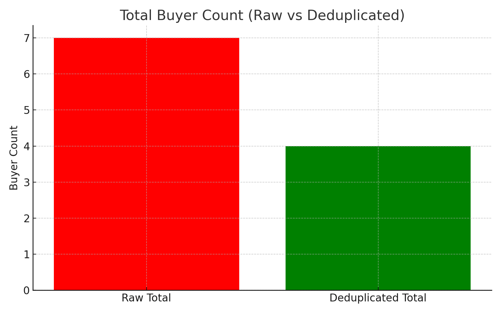
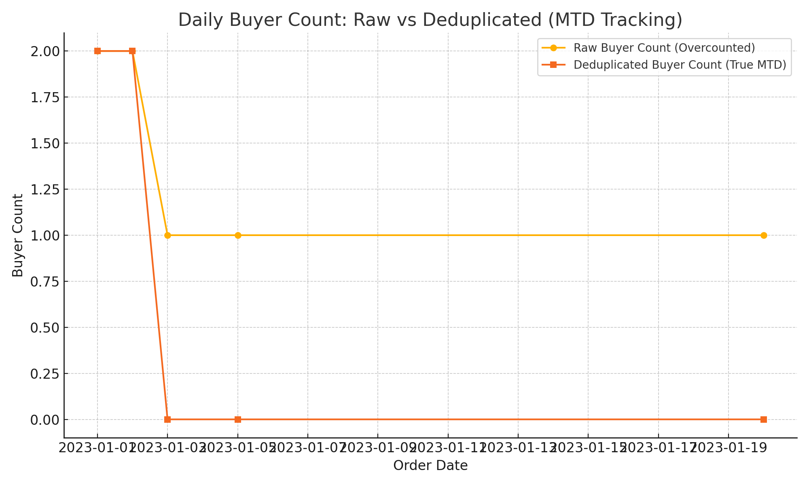
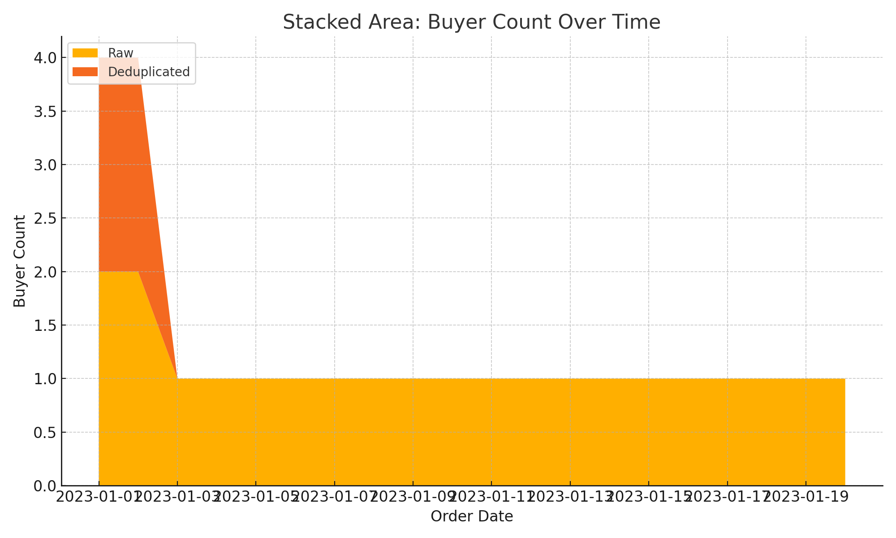

# Buyer Deduplication for MTD Analysis (PySpark)

This project provides a scalable approach for accurately counting **unique buyers month-to-date (MTD)** using PySpark. It is particularly useful for organizations tracking customer acquisition, retention, or daily purchase behavior without inflating counts from repeat purchases.

## ✅ Key Features

- Deduplicates buyers within `(country, channel, sales_channel, month)` buckets
- Ensures each buyer is only counted once per month
- Provides **cumulative daily MTD counts** for true unique buyer trends
- Designed for use with PySpark on large transactional datasets

## 📁 Structure

- `notebooks/`: Interactive development and walkthrough of the logic
- `src/`: Optional reusable PySpark logic for production integration
- `docs/`: Extended documentation, visuals, and SQL examples

## 🛠️ Tech Stack

- PySpark
- Databricks Widgets (for interactive date filtering)
- Spark SQL
- Jupyter Notebooks or Databricks Notebooks

## 🧠 Why Buyer Deduplication Matters

Accurate buyer counting is foundational for reliable performance measurement. Without proper deduplication, repeat buyers within the same period (e.g., month) can be mistakenly counted multiple times, leading to inflated metrics and flawed decisions.

### 🚨 Consequences of Not Deduplicating Buyers

- **Overstated ROAS (Return on Ad Spend)**  
  If the same buyer makes multiple purchases but is counted as multiple “new” or “unique” buyers, your acquisition efficiency looks artificially strong.

- **Unreliable Forecasting**  
  Forecasting demand or buyer growth based on inflated buyer counts results in missed targets, overstock, or under-delivery on marketing goals.

- **Misleading KPI Trends**  
  MTD buyer trends might appear to grow when, in reality, it’s just the same buyers returning — obscuring your view of real acquisition and engagement.

- **Loyalty Misjudgment**  
  Misidentifying loyal buyers as newly acquired or reactivated can distort cohort and lifecycle analysis, affecting CRM and retention strategies.

- **Channel Attribution Errors**  
  Duplicate buyers might be attributed to multiple campaigns or platforms, over-crediting some channels while under-crediting others.

### ✅ What This Project Solves

This approach ensures that each buyer is **only counted once per period per segment**, even if they purchase multiple times. It:

- Supports **true MTD buyer tracking**
- Reduces reliance on resource-intensive operations like full-window distinct counts
- Provides a scalable and reproducible solution for customer-level aggregation in large datasets

## ▶️ Quick Start

1. Clone the repo and navigate to the project:

```bash
git clone https://github.com/<your-username>/buyer-deduplication-mtd.git
cd buyer-deduplication-mtd
```

2. Open the notebook in your Spark-ready environment:

- `notebooks/buyer_deduplication_analysis.ipynb`

3. Set widgets for date filtering:
   - `start_date`, `end_date`, and `analysis_date`

4. Run the notebook to generate deduplicated MTD buyer counts.

---

## 📊 Example Visualizations

These visualizations demonstrate how deduplication changes your understanding of buyer activity:

### 1. Total Buyer Count (Raw vs Deduplicated)

Shows the difference in total buyer count over the analysis period. Deduplication prevents double-counting repeat buyers, especially critical in MTD/QTD/YTD rollups.



---

### 2. Daily Buyer Count Trend

Raw buyer counts appear inflated as the same individuals are counted on multiple days. Deduplicated trends show true MTD acquisition activity.



---

### 3. Stacked Area View

Stacked area chart comparing raw and deduplicated buyer flows over time — great for dashboards or cumulative reporting visuals.



---

## 🧠 SQL Templates Included

This project also includes production-ready SQL logic for buyer deduplication in different reporting periods:

- `docs/sql_examples/mtd_buyer_dedup.sql` – Month-to-date logic
- `docs/sql_examples/qtd_buyer_dedup.sql` – Quarter-to-date logic
- `docs/sql_examples/ytd_buyer_dedup.sql` – Year-to-date logic
- `docs/sql_examples/validation_tests.sql` – Sample QA/validation queries

These are written in SQL and are adaptable to any cloud data warehouse (e.g., Databricks, Snowflake, BigQuery).

---

## 📩 Contact

Created as part of an exploration into improving data accuracy in customer analytics pipelines. Contributions and suggestions welcome!
